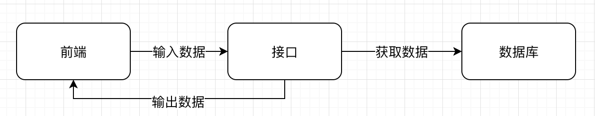

# 接口文档

## 1. 什么是接口文档

> 在项目开发中，web项目的前后端分离开发，APP开发，需要由前后端工程师共同定义接口，编写接口文档，之后大家都根据这个接口文档进行开发，到项目结束前都要一直维护。

- API（Application Programming Interface）即应用程序接口，可以任务是一个软件组件或一个Web服务与外界进行交互的接口，在这里接口可以和API划等号。 



**接口文档**又叫（规范性文档）。

接口文档有规范的格式和内容要求，后端按照接口协议接收前端传递的合法数据和返回符合的规范的数据，前端按照接口协议传递符合规范的数据和对后端返回的数据依据展示的需要做处理。

## 2. 为什么要写接口文档？
1、项目开发过程中前后端工程师有一个统一的文件进行沟通交流开发
2、项目维护中或者项目人员更迭，方便后期人员查看、维护

## 3. 编写规范

### 3.1 内容

文档包含以下内容：

1. 接口说明
2. 请求方式（GET/POST/RETRIEVE/UPDATE)
3. 调用URL（接口地址）
4. 请求参数，包含参数类型及其限制条件
5. 返回参数说明（返回包结构体）
6. 用例

### 3.2 示例

> **接口说明：** 注册接口
>
> **请求方式：** POST  `/api/signup`
>
> **请求参数：** JSON 或 x-www-form-urlencoded
>
> | 参数名   | 类型   | 是否必须 | 说明     |
> | :------- | ------ | -------- | -------- |
> | username | string | yes      | 用户名   |
> | avatar   | string | no       | 头像     |
> | password | string | yes      | 密码     |
> | repasswd | string | yes      | 确认密码 |
> | email    | string | yes      | 邮箱     |
>
> **返回数据：** JSON
>
> | 字段 | 类型    | 是否必须 | 说明       |
> | ---- | ------- | -------- | ---------- |
> | code | integer | yes      | 状态码     |
> | msg  | string  | yes      | 返回的信息 |
> | data | object  | no       | 返回的数据 |
>
> ```js
> {
>   "code": 200,
>   "msg": "注册成功"，
>   "data": null
> }
> ```

