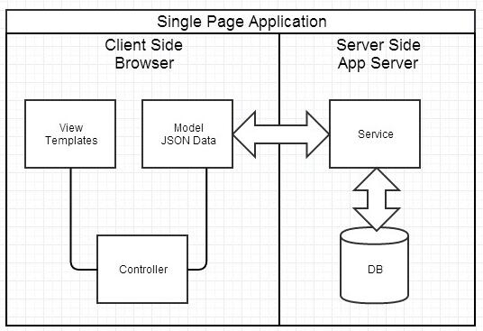

#  前后端分离开发模式

## 1. 背景

随着互联网的高速发展，前端页面的展示、交互体验越来越灵活、炫丽，响应体验也要求越来越高，后端服务的高并发、高可用、高性能、高扩展等特性的要求也愈加苛刻，从而导致前后端研发各自专注于自己擅长的领域深耕细作。

然而带来的另一个问题：前后端的对接界面双方却关注甚少，没有任何接口约定规范情况下各自撸起袖子就是干，导致我们在产品项目开发过程中，前后端的接口联调对接工作量占比在30%-50%左右，甚至会更高。往往前后端接口联调对接及系统间的联调对接都是整个产品项目研发的软肋。

**规范约定先行，尽量避免沟通联调产生的不必要的问题，专注于各自擅长的领域。**

## 2. 为什么要分离

**传统MVC模式**

**典型问题**

1. 前端开发重度依赖开发环境，开发效率低

   前后端协作有两种模式：

   - **一种是前端写demo，写好后，让后端去套模板** 。淘宝早期包括现在依旧有大量业务线是这种模式。好处很明显，demo 可以本地开发，很高效。不足是还需要后端套模板，有可能套错，套完后还需要前端确定，来回沟通调整的成本比较大。
   - **另一种协作模式是前端负责浏览器端的所有开发和服务器端的 View 层模板开发，支付宝是这种模式。** 好处是 UI 相关的代码都是前端去写就好，后端不用太关注，不足就是前端开发重度绑定后端环境，环境成为影响前端开发效率的重要因素。

2. 前后端职责依旧纠缠不清

3. 对前端发挥的局限

**总结**

- 关注点分离

- 职责分离

- 对的人做对的事

- 更好的共建模式

- 快速的反应变化

## 3. 什么是分离

第一阶段：“基于 Ajax 带来的 MPA 时代”，如图：

第二阶段："基于 Ajax 带来的 SPA 时代"，如图：

## 4. 如何分离

### 4.1 职责分离

**职责分离**

- 前后端仅仅通过异步接口(AJAX/JSONP)来交互

- 前后端都各自有自己的开发流程，构建工具，测试集合

- 关注点分离，前后端变得相对独立并松耦合

### 4.2 开发流程

1. 后端编写和维护接口文档，在 API 变化时更新接口文档

2. 后端根据接口文档进行接口开发

3. 前端根据接口文档进行开发 + Mock平台

4. 开发完成后联调和提交测试

**Mock 服务器根据接口文档自动生成 Mock 数据，实现了接口文档即API：**

